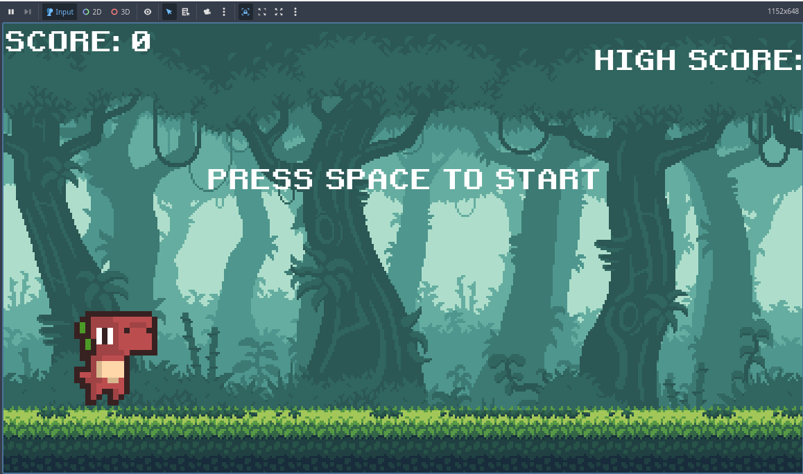

# Leap of Ages

**Leap of Ages** is a 2D side-scrolling game developed in the [Godot Engine](https://godotengine.org/) using GDScript. Guide a prehistoric creature as it leaps through a dangerous environment, dodging obstacles and aiming for a high score!

---

## 📋 Table of Contents

- [Getting Started](#-getting-started)
- [Screenshots](#-screenshots)
- [Gameplay Overview](#-gameplay-overview)
- [Project Structure](#-project-structure)
- [Developer Credits](#-developer-credits)
- [Contributing](#-contributing)
- [License](#-license)

---

## 🚀 Getting Started

### Prerequisites

- [Godot Engine](https://godotengine.org/download) (recommended version: 4.x)
- Basic knowledge of GDScript (for contributors)

### Running the Project

1. Clone the repository:
    ```bash
    git clone https://github.com/PTA-Avenger/leap-of-ages.git
    ```
2. Open the project in Godot using the `project.godot` file inside the `rex/` directory.

---

## 🖼️ Screenshots

Here are some in-game screenshots of **Leap of Ages**:




---

## 🧠 Gameplay Overview

In **Leap of Ages**, players control a dinosaur-like creature that must leap over various obstacles such as barrels, rocks, and tree stumps. The goal is to survive as long as possible while the game speed increases.

**Core Mechanics:**
- **Jumping** over obstacles to avoid collision
- **Scrolling environment** that accelerates
- **Game Over screen** upon collision
- **HUD** to display score and power-ups or time survived
- **Opening Scene** that introduces the game world

---

## 📁 Project Structure
